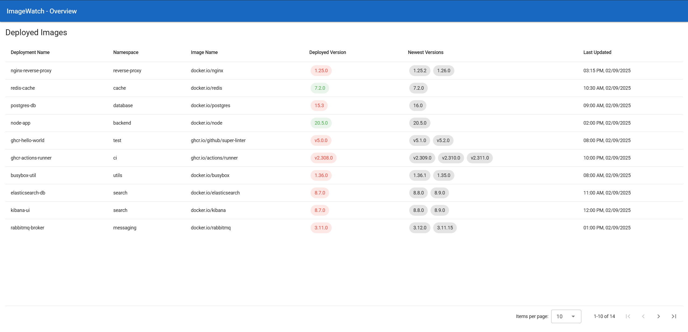

## ImageWatch
ImageWatch is a service that checks for outdated Images of services running in a Kubernetes cluster.



## Deployment
This repository contains the deployment definitions for running the 
ImageWatch client in a Kubernetes environment.

### Prerequisites
- A Kubernetes cluster (at least version 1.17)
- kubectl command-line tool configured to interact with your cluster
- Helm (optional, for managing deployments)

### Deployment Steps
1. Clone the repository:
   ```bash
   git clone https://github.com/Florianisme/ImageWatch
    ```
2. Review and customize the deployment files as needed
3. Deploy the service using kubectl:
   ```bash
   kubectl apply -f plain/
   ```
4. Verify the deployment:
   ```bash
   kubectl get pods -n image-watch
   ```
